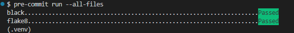

# Playwright and Pytest Framework

## Table of Contents

- [Getting Started](#getting-started)
- [Setting Up a Virtual Environment](#setting-up-a-virtual-environment)
- [Installing Dependencies](#installing-dependencies)
- [Code Formatting](#code-formatting)
- [Code Linting](#code-linting)
- [Pre-commit Hooks](#pre-commit-hooks)

## Getting Started

**Prerequisites**

- **Python 3.7+**: Make sure you have Python 3.7 or higher installed.
- **Pip**: Python package installer should be available.
- **Git**: Required for version control.
- **Node.js**: Needed for Playwright browsers (Playwright will install it automatically if not present).
- **Visual Studio Code**: Recommended IDE for this project (optional).

**Clone the Repository**

Begin by cloning the repository to your local machine:

```bash
git clone https://github.com/MaartinBo/playwrightPyMB.git
cd playwrightPyMB
```

## Setting Up a Virtual Environment

It's recommended to create a virtual environment for this project to manage dependencies cleanly:

**1.Create the Virtual Environment:**

```bash
python3 -m venv .venv
```

**2.Activate the Virtual Environment:**

Use the appropriate command based on your terminal and operating system:

**Git Bash on Windows:**

```
source .venv/Scripts/activate
```

**Linux/Mac:**

```
source .venv/bin/activate
```

**For Windows (basic cmd)**

```
.venv\Scripts\activate
```

**For Windows(powershell)**

```
.venv\Scripts\Activate.ps1
```

## Installing Dependencies

With the virtual environment activated, install the required packages by running:

```bash
pip install -r requirements.txt
```

## Code Formatting

I use **Black** for code formatting.

The configuration is stored in `pyproject.toml`

To launch black in "check" mode run:

```bash
black --check .
```

To format the code run:

```bash
black  .
```

## Code Linting

I use **Flake8** for linting to maintain code quality.

The configuration is stored in `pyproject.toml` using the `flake8-pyproject` plugin.

To run the linter use:

```bash
flake8
```

## Pre-commit Hooks

I use pre-commit to automate code formatting and linting.

### Installing Pre-commit Hooks

To set up pre-commit hooks for this project, run:

```bash
pre-commit install
```

### Running Pre-commit Hooks Manually

To run all hooks against all files:

```bash
pre-commit run --all-files
```

Expected result:


